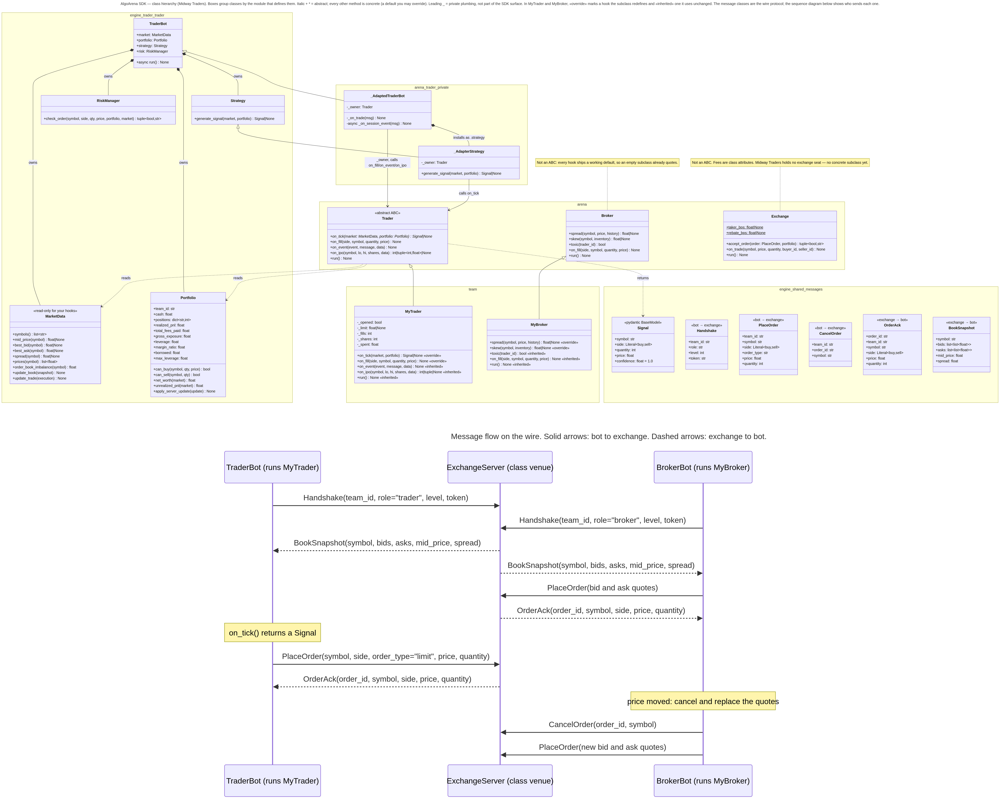

# UML class diagram

The image has two parts. The class diagram on top shows the SDK base classes, our subclasses (with each hook marked «override» or «inherited»), the engine classes behind them, and the message types. The sequence diagram below it shows the direction each message travels between the bots and the exchange.

The design justification is in [DESIGN.md](DESIGN.md).

## Where each class in the diagram lives

| File | Classes |
| --- | --- |
| `arena/trader.py` | `Trader`, `_AdaptedTraderBot`, `_AdapterStrategy` |
| `arena/broker.py` | `Broker` |
| `arena/exchange.py` | `Exchange` |
| `team/trader.py` | `MyTrader` |
| `team/broker.py` | `MyBroker` |
| `engine/trader/trader.py` | `MarketData`, `Portfolio`, `Strategy`, `RiskManager`, `TraderBot` |
| `engine/shared/messages.py` | `Signal`, `Handshake`, `PlaceOrder`, `CancelOrder`, `OrderAck`, `BookSnapshot` |
| `engine/broker/broker.py` | `BrokerBot` (sequence diagram) |
| `engine/exchange/server.py` | `ExchangeServer` (sequence diagram) |

`Signal` is re-exported by `arena/__init__.py`, so `from arena import Signal` and
`from shared.messages import Signal` both resolve to the same class.
